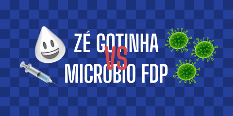

 

  

  <h3 align="center">Zé Gotinha VS Micróbio FDP</h3>

  

    <a href="https://dada1smo.github.io/1stProject_ZeGotinha/">Play now</a>
  

# Introduction

This is a Plants VS Zombies-inspired tower defense game where you will need to create Zé Gotinhas (Brazil's vaccination mascot) in order to shoot down and stop the invading viruses.

# Instructions
- Click on the board to create Zé Gotinhas (towers) - every tower costs 100 doses.
- Hover over white SUS spheres to collect extra doses.
- Stop the invanding virus from reaching the other side.
- Once you reach the winning score of 400 you've won the game!
- Enjoy!

# Credits
- Emojis taken from [Emojipedia](https://emojipedia.org/) (custom Zé Gotinha made by me).
- Background music is [AdhesiveWombat - Night Shade](https://www.youtube.com/watch?v=py60u7pnRUA).